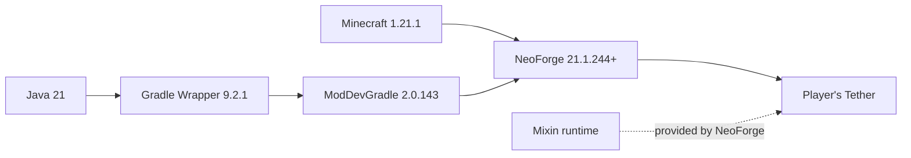
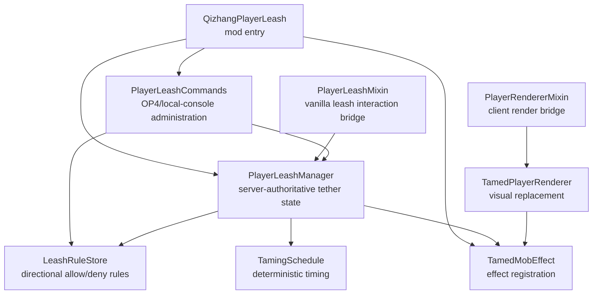

# Dependencies and architecture / 依赖与代码关系

## External dependencies / 外部依赖

| Layer / 层级 | Version / 版本 | Purpose / 用途 |
| --- | --- | --- |
| Java | 21 | Compile and run the mod / 编译和运行模组 |
| Minecraft | 1.21.1 | Game API and runtime / 游戏 API 与运行环境 |
| NeoForge | 21.1.244 to 21.1.x | Loader, events, networking, registries, and bundled Mixin runtime / 加载器、事件、网络、注册表及其内置 Mixin 运行时 |
| ModDevGradle | 2.0.143 | NeoForge development and packaging / NeoForge 开发与打包 |
| Gradle Wrapper | 9.2.1 | Reproducible build entry point / 可复现构建入口 |

The mod has no dependency on another gameplay mod. The same mod JAR is required on the dedicated server and every connecting client.

本模组不依赖其他玩法模组。专用服务器和所有连接客户端都必须安装同一份 JAR。

## Internal component relationships / 内部代码关系

## Runtime boundary / 运行边界

- The server owns tether state, permission checks, release conditions, effect progression, and rule persistence.
- The client only replaces the local rendering path when the synchronized effect is present.
- The renderer does not change inventory, hitbox, game mode, permissions, or player identity.
- Rule changes are accepted only from a real permission-level-4 player or the direct local server console.

- 服务端负责拴绳状态、权限检查、断开条件、效果进度和规则持久化。
- 客户端只在同步效果存在时替换渲染路径。
- 渲染器不会修改背包、碰撞箱、游戏模式、权限或玩家身份。
- 规则修改仅接受权限 4 级真人管理员或服务器本地控制台。
