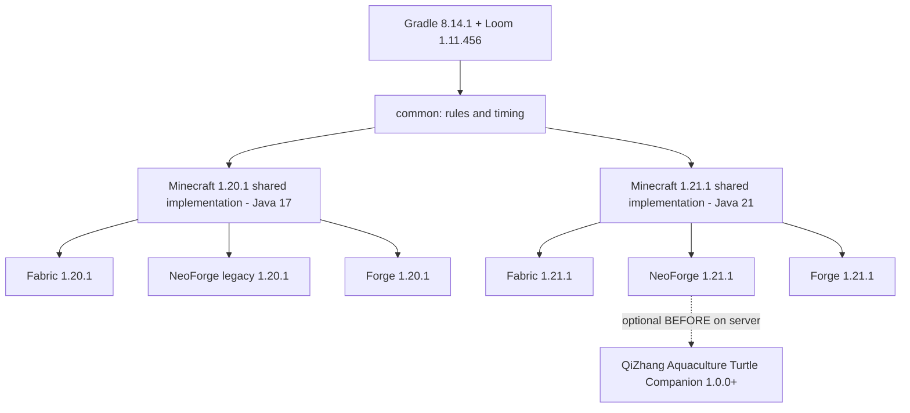
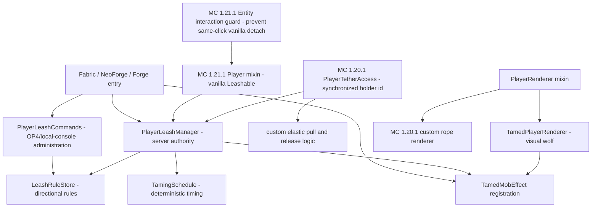

# Dependencies and architecture / 依赖与代码关系

## External dependencies / 外部依赖

| Layer / 层级 | Pinned build target / 固定构建目标 | Purpose / 用途 |
| --- | --- | --- |
| Java | 17 for MC 1.20.1; 21 for MC 1.21.1 | Target runtime and class version / 目标运行时与字节码版本 |
| Minecraft | 1.20.1 and 1.21.1 | Game API and runtime / 游戏 API 与运行环境 |
| Fabric | Loader 0.19.3; API 0.92.11+1.20.1 or 0.116.15+1.21.1 | Fabric entry points, events, and packaging / Fabric 入口、事件与打包 |
| NeoForge | 21.1.244 for MC 1.21.1 | Modern NeoForge entry points, events, registries, and packaging / 现代 NeoForge 入口、事件、注册与打包 |
| QiZhang Aquaculture Turtle Companion | 1.0.0+; NeoForge 1.21.1 server only; optional | Deterministic event ordering for disjoint player/non-player targets / 为互不重叠的玩家与非玩家目标确定事件顺序 |
| NeoForge legacy | `net.neoforged:forge:1.20.1-47.1.106` | Experimental legacy Forge-compatible target / 实验性历史 Forge 兼容目标 |
| Forge | 47.4.10 for MC 1.20.1; 52.1.0 for MC 1.21.1 | Forge entry points, events, registries, and packaging / Forge 入口、事件、注册与打包 |
| Architectury Loom | 1.11.456 | Mojang-mapped multi-target development and remapping / Mojang 映射的多目标开发与重映射 |
| Gradle Wrapper | 8.14.1 | Reproducible build entry point and Java toolchain selection / 可复现构建入口与 Java 工具链选择 |

The mod has no required dependency on another gameplay mod. Fabric builds require the matching Fabric API. A dedicated server and every connecting client must use the same Minecraft-version/loader JAR. NeoForge 1.21.1 metadata optionally orders Player's Tether before QiZhang Aquaculture Turtle Companion; no companion classes are linked or loaded by this mod.

本模组不强制依赖其他玩法模组；Fabric 版本需要对应的 Fabric API。专用服务器和所有连接客户端必须使用 Minecraft 版本与加载器完全一致的 JAR。NeoForge 1.21.1 元数据可选地让玩家拴绳先于 QiZhang Aquaculture Turtle Companion 加载，但本模组不会链接或加载伙伴模组的任何类。

NeoForge 1.20.1 is the discontinued 47.x compatibility line, not the modern NeoForge platform. It shares the Forge-era API source layer but is compiled and packaged against the separate `net.neoforged` artifact. It remains an experimental release target.

NeoForge 1.20.1 是已停止维护的 47.x 兼容线，并非现代 NeoForge 平台。它与 Forge 时代共用 API 源码层，但针对独立的 `net.neoforged` 产物编译与打包，发布状态保持为实验性。

## Internal component relationships / 内部代码关系

The source tree is layered so that game rules and timing are loader-independent, Minecraft API differences are isolated by game version, and loader modules only contain entry points, registrations, event bridges, and metadata.

源码按层拆分：规则与计时不依赖加载器；Minecraft API 差异按游戏版本隔离；加载器模块只保留入口、注册、事件桥接和元数据。

Minecraft 1.21.1 exposes the general `Leashable` API used by the vanilla synchronization and physics path. Its interaction guard prevents the same click from attaching and then immediately toggling the player leash off, while its distance override keeps a valid tether elastic beyond vanilla's ten-block cutoff. Minecraft 1.20.1 stores leash behavior on mobs instead, so that version has its own synchronized player holder ID, server-authoritative elastic physics/release logic, and client rope renderer. These version layers are intentionally not merged.

Minecraft 1.21.1 提供通用 `Leashable` API，可复用原版同步与物理路径；其交互保护会阻止同一次点击先建立、随后又被原版立即解除玩家拴绳，距离覆盖则让有效拴绳超过原版十格后继续弹性拉回。Minecraft 1.20.1 的拴绳逻辑仍位于生物实体，因此该版本使用独立的玩家持有者 ID 同步、服务端弹性物理/解除逻辑及客户端绳线渲染。这两个版本层有意保持分离。

## Runtime boundary / 运行边界

- The server owns tether state, permission checks, release conditions, effect progression, and rule persistence.
- Loader death events release involved player links before vanilla's static 1.21.1 cleanup; dimension changes preserve the consumed-lead decision until the after-change event settles it.
- The client renders synchronized tether/effect state and never decides server rules or item consumption.
- The wolf replacement is visual only; it does not change inventory, hitbox, game mode, permissions, or player identity.
- Rule changes are accepted only from a real permission-level-4 player or the direct local server console.
- Every release JAR contains exactly one loader metadata file, the Mixin config and non-empty refmap, the correct resource-pack format, and the class version required by its Minecraft target.

- 服务端负责拴绳状态、权限检查、断开条件、效果进度和规则持久化。
- 各加载器的死亡事件会在原版 1.21.1 静态清理前解除相关玩家连接；维度切换则保留拴绳消耗记录，直到切换后事件完成结算。
- 客户端仅渲染已同步的拴绳/效果状态，不决定后台规则或物品消耗。
- 狼模型替换仅改变画面，不修改背包、碰撞箱、游戏模式、权限或玩家身份。
- 规则修改仅接受权限 4 级真人管理员或服务器本地控制台。
- 每个发布 JAR 只包含一种加载器元数据，同时包含 Mixin 配置、非空 refmap、正确的资源包格式及目标 Minecraft 所需的字节码版本。

## Validation boundary / 验证边界

Compilation, deterministic self-tests, version-specific Mixin structure, JAR metadata, checksums, and dedicated-server startup/shutdown are automated. `NEEDS_MANUAL_VALIDATION`: two-client synchronization, pulling and long-distance behavior, lead rendering, wolf replacement, and heart particles still require real-client acceptance, with special attention to the independent Minecraft 1.20.1 renderer.

编译、确定性自测、按版本区分的 Mixin 结构、JAR 元数据、校验和及专用服务端启停均有自动验证。`NEEDS_MANUAL_VALIDATION`：双客户端同步、拉力与远距离行为、绳线、狼模型与爱心粒子仍需真实客户端验收，尤其应重点检查 Minecraft 1.20.1 的独立渲染实现。
